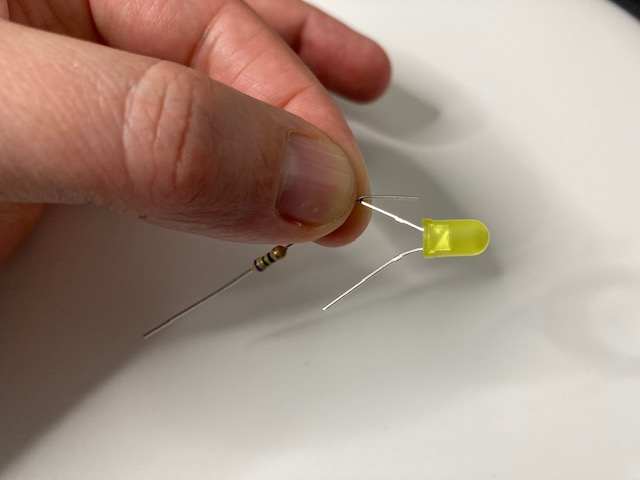
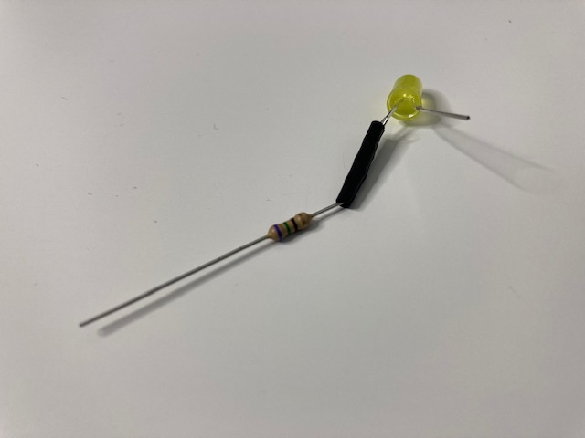

## جمع المكونات

سوف تحتاج:
+ 2 × أسلاك توصيل مقبس-مقبس
+ 1 × مقاومة
+ 1 × مصباح LED
+ شريط كهربائي
+ مقص

## العثور على الساق الموجبة لمصباح LED

يحتوي LED على ساق "موجبة" ** positive ** وساق "سالبة" **negative **. الساق الطويلة موجبة والساق القصيرة سالبة.

{:width="200px"}

**نصيحة**: هناك طريقة أخرى للتحقق مما إذا كانت الساق موجبة أو سالبة وهي استخدام إصبعك للعثور على الجانب المسطح من مصباح LED. **الجانب المسطح** يوجد على نفس جهة الساق **السالبة**.

## قم بلف المقاومة حول الساق الموجبة لمصباح LED

إثنِ إحدى أرجل المقاومة حول الساق الموجبة لمصباح LED.

قم بلف ساق المقاومة حول ساق LED حوالي ثلاث مرات.

## قم بتأمين المقاومة بإستعمال شريط كهربائي

قص قطعة صغيرة من الشريط الكهربائي والصقها حول المقاومة الملتوية. هذا سيساعد على جعلها أكثر أمانا.

## قم بتوصيل السلكين

قم بتوصيل سلك توصيل بالطرف الآخر من المقاومة.

قم بتوصيل السلك الآخر بالساق السالب لمصباح LED.

**نصيحة**: إذا كانت مرتخية كثيرا، فقم بإضافة المزيد من الشريط الكهربائي عبر الوصلات.
