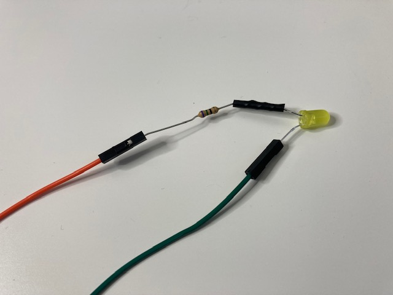

## Συγκέντρωσε τα εξαρτήματα

Θα χρειαστείς:
+ 2 x καλώδια socket-socket jumper
+ 1 x αντίσταση
+ 1 x LED
+ Μονωτική ταινία
+ Ψαλίδι

## Βρες το θετικό πόδι ενός LED

Ένα LED έχει **θετικό** πόδι και **αρνητικό** πόδι. Το μακρύ πόδι είναι το θετικό και το κοντό είναι το αρνητικό.

{:width="200px"}

**ΣΥΜΒΟΥΛΗ**: Ένας άλλος τρόπος για να ελέγξεις εάν ένα πόδι είναι θετικό ή αρνητικό είναι να χρησιμοποιήσεις το δάχτυλό σου για να βρεις την επίπεδη πλευρά του λαμπτήρα LED. Η **επίπεδη πλευρά** βρίσκεται στην ίδια πλευρά με το **αρνητικό** πόδι.

## Περίστρεψε την αντίσταση γύρω από το θετικό πόδι του LED

Λύγισε ένα από τα πόδια της αντίστασης γύρω από το θετικό πόδι του LED.

Περίστρεψε το πόδι της αντίστασης γύρω από το πόδι LED τρεις φορές.

## Στερέωσε την αντίσταση με μονωτική ταινία

Κόψε ένα μικρό κομμάτι μονωτικής ταινίας και κόλλησέ το γύρω από τη στριμμένη αντίσταση. Αυτό θα σε βοηθήσει να το κάνεις λίγο πιο ασφαλές.

## Σύνδεσε τα δύο καλώδια jumper

Σύνδεσε ένα καλώδιο jumper στο άλλο άκρο της αντίστασης.

Σύνδεσε το άλλο καλώδιο jumper στο αρνητικό πόδι της λυχνίας LED.

**ΣΥΜΒΟΥΛΗ**: Εάν είναι αρκετά χαλαρά, πρόσθεσε λίγη ακόμα μονωτική ταινία κατά μήκος των ενώσεων.
