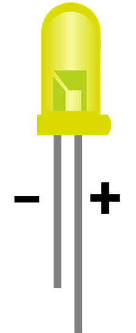
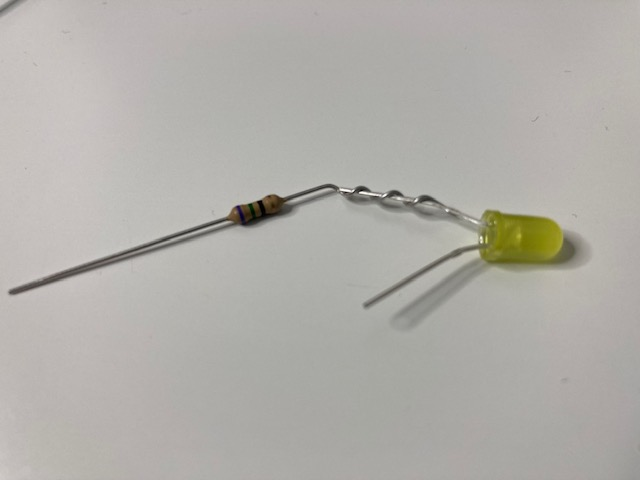
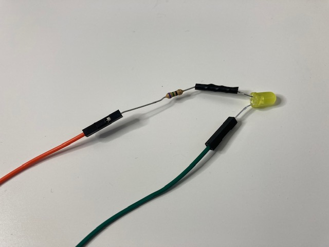

## Rassembler les composants

Tu auras besoin de :
+ 2 x fils de liaison femelle-femelle
+ 1 x résistance
+ 1 x LED
+ Du ruban isolant
+ Des ciseaux

## Trouver la patte positive d'une LED

Une LED a une patte **positive** et une patte **négative**. La longue patte est le positif et la courte est le négatif.

{:width="200px"}

**ASTUCE**: Une autre façon de vérifier si une patte est positive ou négative est d'utiliser ton doigt pour trouver le côté plat de l'enveloppe plastique de la LED. Le **côté plat** est du même côté que la patte **négative**.

## Enrouler une des pattes de la résistance autour de la patte positive de la LED

Plie l'une des pattes de la résistance autour de la patte positive de la LED.

Tourne la patte de la résistance autour de la patte de la LED environ trois fois.

## Fixer la résistance avec du ruban isolant

Coupe un petit morceau de ruban isolant et colle-le autour de la résistance torsadée. Cela contribuera à la rendre un peu plus résistante.

## Attacher les deux fils de liaison

Attache un fil à l'autre extrémité de la résistance.

Attache l'autre fil de liaison à la patte négative de la LED.

**CONSEIL**: S'il y a du jeu avec les fils, ajoute un peu plus de ruban isolant sur les raccords.
