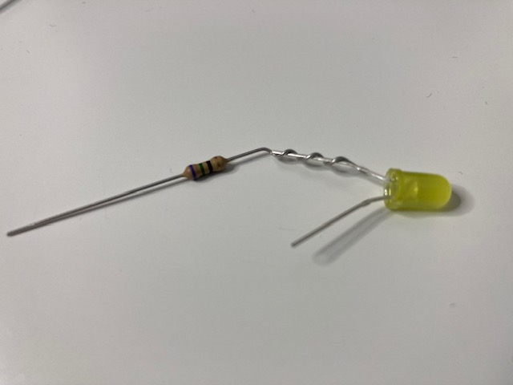

## Verzamel onderdelen

Je hebt nodig:
+ 2 x bus-bus jumperdraden
+ 1 x weerstand
+ 1 x LED
+ Isolatietape
+ Schaar

## Zoek de positieve aansluiting van een LED

Een LED heeft een **positieve** en een **negatieve** aansluiting. Het lange draadje is positief en het korte is negatief.

{:width="200px"}

**TIP**: Een andere manier om te controleren of de aansluiting positief of negatief is, is door je vinger te gebruiken om de platte kant van de LED-lamp te vinden. De **platte kant** bevindt zich aan dezelfde kant als de **negatieve** aansluiting.

## Draai de weerstand rond de positieve aansluiting van de LED

Buig een van de poten van de weerstand om de positieve aansluiting van de LED.

Draai de weerstand drie keer rond de LED-aansluiting.

## Zet de weerstand vast met isolatietape

Knip een klein stukje isolatietape en plak het rond de gedraaide weerstand. Dit zal helpen om het een beetje veiliger te maken.

## Sluit de twee jumperdraden aan

Sluit een jumperdraad aan op het andere uiteinde van de weerstand.

Bevestig de andere jumperdraad aan de negatieve kant van de LED.

**TIP**: Als ze een beetje los zijn, plak dan wat meer isolatietape over de verbindingen.
