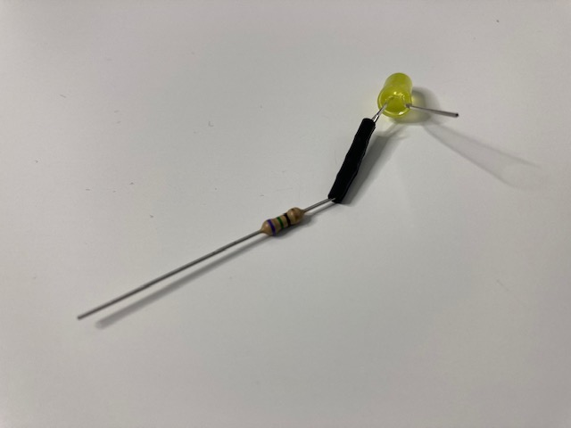

## Plocka fram komponenter

Du behöver:
+ 2 x uttag-uttag byglingskablar
+ 1 x motstånd
+ 1 x Lysdiod
+ Eltejp
+ Sax

## Hitta det positiva benet på en lysdiod

En lysdiod har ett **positivt** ben och ett **negativt** ben. Det långa benet är positivt och det korta benet är negativt.

{:width="200px"}

**TIPS**: Ett annat sätt att kontrollera om ett ben är positivt eller negativt är att använda fingret för att hitta den platta sidan på lysdioden. Den **platta sidan** är på samma sida som den **negativa** benet.

## Vrid ena benet på motståndet runt det positiva benet på lysdioden

Böj ett av motståndets ben runt det positiva benet på lysdioden.

Vrid motståndsbenet runt lysdiodsbenet tre gånger.

## Fäst motståndet med eltejp

Klipp till en liten bit eltejp och fäst den runt det tvinnade motståndet. Detta kommer att göra så det sitter fast det lite bättre.

## Fäst de två byglingskablarna

Fäst en byglingskabel till den andra änden av motståndet.

Fäst den andra byglingskabeln till det negativa benet på lysdioden.

**TIPS**: Om de sitter löst, använd lite mer elektrisk tejp över skarvarna.
